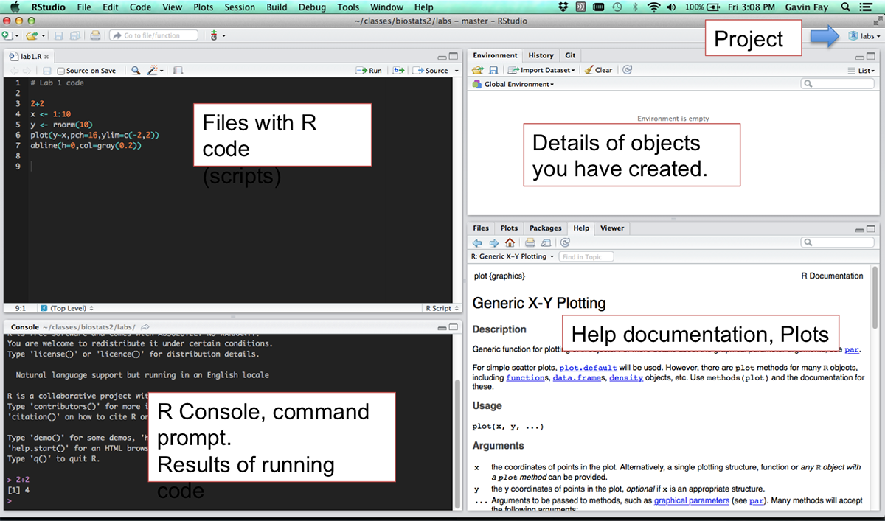
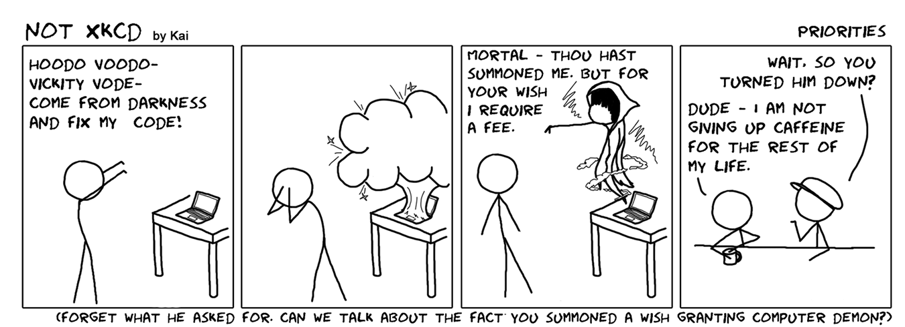
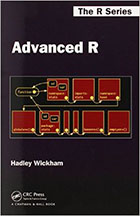

## Lab schedule

__1/27: Introduction to R and R Studio, working with data__  
2/03: Intro to plotting, manipulating data  
2/10: Probability, linear modeling, PCA  
2/17: Programming practices, conditional statements  
2/24: Creating functions, debugging  
3/02: Permutation analysis  
3/09: Advanced plotting  

## Why R?

 __Reproducible__  
  - command line interface encourages organization  
  - scripts allow others (and you!) to reproduce analyses from end-to-end
 
 __Extensible__  
  - new methods delivered as developed  
  - continual expansion through new packages  
 
 __Open-source__  
  - all code can be examined by the user
  
 __Free__  
  - available to large set of users (and therefore developers)
 
 R is not the only solution out there.  
 The real goal is not to teach R, but concepts that all programming depends on.
 
***

Trevor Branch rule:  

> "Every analysis you do on a dataset will have to be redone 10–15 times before publication. Plan accordingly."


## Recommended reading

An introduction to R (Venables et al.)  
– <http://cran.r-project.org/doc/manuals/R-intro.pdf>
- Today's material: Chapters 1-6.

R reference card 2.0 (Baggott)  
– <http://cran.r-project.org/doc/contrib/Baggott-refcard-v2.pdf>  
– Extremely useful handout: put on wall in view of your desk  

There are many (many) R books out there. Good for reference. e.g.  
- The R Book (Crawley)  
- Modern Applied Statistics with S (Venables and Ripley)  
- Dalgaard (2002) Introductory Statistics with R.

## Installing R and R Studio

 __R__ (<http://r-project.org>)  
  - download appropriate version for your OS
 
 __R Studio__ (<http://rstudio.com>)  
  - a very good Integrated Development Environment (IDE) for R  
  provides:  
  - text editor  
  - syntax highlighting  
  - seamless code execution with R  
  
 You can use other text editors with R, but RStudio well organized.  
 (also looks same regardless of Operating System)
   

## Getting started

Enter instructions at R console command line prompt (`>`):  
e.g. type
```{r,results='hide',prompt=TRUE,strip.white=TRUE}
2 + 2
```
R acts as a calculator and returns (prints) the result.
```{r,prompt=TRUE,strip.white=TRUE,collapse=TRUE,comment=''}
2 + 2
```
The [1] indicates the first element of the result.
It is not important here as our calculation involves scalars.

## Simple commands

```{r,prompt=TRUE,strip.white=TRUE,collapse=TRUE,comment=''}  
3^2
2*(2+2)
2*2+2
log(10)
exp(1)
x <- 3
2*x
```
The `<-` means 'assign'.
i.e. 'assign a value of 3 to the variable x'.
`<-` is preferable to using `=`

## Scripts and RStudio

- Typing commands into the console can get tedious.  

- Scripts are text files containing lines of code.  

- Provide a complete record of analyses.
 
- Code can be run (executed) from these files repeatedly.  

- Scripts can be created in a text editor and copied into the R console.  

Or...  

- RStudio integrates scripts, R console, and output in a user-friendly development environment.  

- To run code in RStudio, select code and type  
`Ctrl+Enter`  (Windows)  
`Command+Enter` (Mac)  
The code will run in the R console.  

## RStudio



## Getting Help in R

R is a programming language, there is a learning curve.  

Fortunately, there are lots of resources:  



__Don't__ summon a wish-granting computer demon.  

## Getting Help in R

R is a programming language, there is a learning curve.  

Fortunately, there are lots of resources:  
 - help files  
 - online search results (Seriously, how good is Google?)  
 - books  
 - colleagues  
\begingroup
\fontsize{10}{11}\selectfont
```{r prompt=TRUE,results='hide',collapse=TRUE}
?(mean)
help("mean")
```
The above both get help for the function `mean`.  
Use `help.search("function.name")` to search across packages.  

`str(object.name)` shows the structure of an object.
\endgroup

## R Help files (`?mean`)

 Common format:
 
 - Description (what the function does)  
 - Usage (how to use it)  
 - Arguments (what the function needs, options)  
 - Value (what does the function return)  
 - See Also (related functions)  
 - Examples (sample code showing how the function works)  

 Read function documentation and explore behavior by running examples!  

## Lab exercise 1/4
(Instructions also in lab1_exercise.pdf)  

Open a new R script. Save it. (name it lastname_lab1.R or something similar)  
At the top of the script, add comments with your name and lab 1. (comments are text preceded by a "`#`")  
Work in pairs or individually.  
Submit your R script to Gavin before lab next week.  

Write code that evaluates the following when run.
$$7 + 5(4+3)$$
$$e^{-5(0.2+0.15)}$$
$$\frac{\sqrt{1+2(3+2)}}{\ln(3^2+2)}$$  

## Objects
 Common types of objects  
 - Numbers  
 - Characters (i.e. text or strings)  
 - Tables  
 - Vectors and matrices  
 - Plots  
 - Statistical output  
 - Functions  

Objects in R are global   

Viewing objects: In RStudio see top-right Workspace tab  
More generally:  
\begingroup
\fontsize{10}{11}\selectfont
```{r prompt=TRUE,comment='',results='hide',eval=FALSE}
  print(myobject)
  myobject
```
\endgroup
`ls()` lists all objects in the workspace.  
Use `rm()` to remove an object.  

## Data types (modes)
Describe how objects are stored in computer memory.  

In R you do ___not___ need to specify the data type.  

Common data types:  

- Numeric (integer, floating point numbers or doubles)  

- Logical (Boolean, true or false)  

- Characters (text or string data)  

Types are not always obvious in R, but can be important to know.

## Data types II
```{r prompt=TRUE,comment='',strip.white=TRUE,collapse=TRUE}
myobject <- log(10)
mode(myobject)
is.numeric(myobject)
typeof(myobject)
newobject <- as.integer(myobject)
typeof(newobject)
is.character(myobject)
typeof("hello world")
```

## Vectors
```{r prompt=TRUE,comment='',collapse=TRUE,tidy=TRUE}
weights <- c(2.3,5.4,7.5,9)
print(weights)
years <- 2007:2016
print(years)
years <- seq(from=2000,to=2016,by=2)
print(years)
x <- rep(3,times=10)
print(x)
rep(1:3,times=3)
rep(1:3,length=10)
```

## More on Vectors

  Vectors are ordered and can be referred to by element(s) using [ ]
  
```{r prompt=TRUE,comment='',collapse=TRUE}
(years <- 2007:2016)
years[3]
years[5:6]
which(years==2010)
years[-c(2,4)] # A negative index excludes elements
```
  
  Vector operations are element-wise
  
```{r prompt=TRUE,comment='',collapse=TRUE}
(x <- 1:5)
2*x
```

## Lab exercise 2/4 

(Instructions also in lab1_exercise.pdf)  

Create vectors using `seq()`, `rep()`, and mathematical operators.
Only use `c()` when absolutely necessary.  
_hint_ Remember you can get help on a function by typing `?functionname`  

- Positive integers from 1 to 99  
- Odd integers between 1 and 99  
- The numbers 1,1,1, 2,2,2, 3,3,3  
- The numbers -5,-4,-3,-5,-4,-3,-5,-4,-3  
- The fractions 1, 1/2, 1/3, 1/4, …, 1/10  
- The cubes 1, 8, 27, 64, 125, 216  

## Useful functions
\begingroup
\fontsize{10}{11}\selectfont
```{r prompt=TRUE,comment='',collapse=TRUE}
x <- c(5,3,2,6,3,9,1,18)
length(x)  # length of vector x
sort(unique(x))  # sorted vector of unique values in x
min(x)     # minimum value in x
max(x)     # maximum value in x
mean(x)    # mean of x
median(x)  # median of x
sd(x)      # standard deviation of x
range(x)   # range of values in x
range(x)[2]  # 2nd element of values returned by range()
quantile(x) # optional argument 'probs' can be handy
```
\endgroup

## Boolean logic operators

Operator  | R Code
----------| ------
AND       | & (&&)
OR        | \|  (\|\|)
NOT       | !
less than | <
greater than | >
less than or equal | <=
greater than or equal | >=
equals | ==
NOT equal | !=

&& and || are used when asking IF statements.  
These only use a single value, not a vector.  

## Boolean examples
\begingroup
\fontsize{9}{10}\selectfont
```{r comment='',prompt=TRUE,collapse=TRUE}
x <- 7 
x == 7 
x < 10 
x < -3 
x > 0 & x <= 12
x >= 10 | x < 0 
```
```{r comment='',prompt=TRUE,collapse=TRUE}
y <- c(4,8)
y > 5   #returns a logical vector
y[y>5]  #returns elements of y that meet condition
which(y>5) #index of y that meets condition
any(y>5)
all(y>5)
```
\endgroup

## Lab exercise 3/4 

Complete the following using the vector `y`:  
$$ y <- c(3,2,15,-1,22,1,9,17,5) $$

- Display the first and last values.  
- Find the last value for a vector of any length.  
- Display the values that are greater than the mean of `y`.  
- Display the positions (indices) of the values greater than the mean.  
- Are all the values positive?  
- Are any of the values equal to the mean?  
- Are any of the values equal to the median?  

## Other types of objects
\begingroup
\fontsize{10}{11}\selectfont

___matrices___ (more generally, arrays)  
 - multi-dimensional generalizations of vectors.  
 - are vectors that can be indexed by two or more indices.  

___factors___  
 - compact ways to handle categorical data.  
 
___lists___  
 - general form of vector, elements need not be the same type.  
 - elements often themselves vectors or lists.  
 - convenient way to return results of statistical computations.  
 
___dataframes___  
 - matrix-like structures, columns can be of different types.  
 - often ‘data matrices’ with one row per observational unit but with (possibly)
both numerical and categorical variables.  
 - experiments are often best described by data frames: treatments are categorical but the response is numeric.  

___functions___  
 - are themselves objects in R which can be stored in the project’s workspace.  
 - provide a simple and convenient way to extend R.  

\endgroup

## Dataframes

There are lots of data set examples in R.  
e.g. record times for 35 Scottish hill races  
\begingroup
\fontsize{10}{11}\selectfont

```{r prompt=TRUE,comment='',collapse=TRUE,R.options=library(MASS)}
library(MASS)
head(hills,n=3) # shows first few lines. Also tail()
names(hills)  # get the names of the data frame
```
\endgroup

Creating dataframes
\begingroup
\fontsize{10}{11}\selectfont

```{r prompt=TRUE,comment='',collapse=TRUE}
fish <- c("cod","haddock","dogfish","pollock")
length <- c(34,23,75,18)
age <- c(6,3,17,2)
fish.data <- data.frame(fish=fish,length=length,age=age)
head(fish.data)
```
\endgroup

## Extracting information from data frames
\begingroup
\fontsize{10}{11}\selectfont
Use the $ to extract vectors from a data frame
```{r prompt=TRUE,comment='',collapse=TRUE,R.options=library(MASS)}
hills$dist
```
You can also specify the row index, column index, or both
`object[row,column]`  
```{r prompt=TRUE,comment='',collapse=TRUE,R.options=library(MASS)}
# extract the element in row 1, column 2
hills[1,2]
hills$climb[1]
# extract the first row
hills[1,]
```
\endgroup

----
\begingroup
\fontsize{10}{11}\selectfont
```{r prompt=TRUE,comment='',collapse=TRUE,R.options=library(MASS)}
# extract all of column 2
hills[,2]   # also hills[,"climb"]
# exclude column 1, but retain the other columns (1st 3 rows)
hills[1:3,-1]  
# extract rows 4 and 7
hills[c(4,7),]
# extract the rows that are specified by the object x
x <- c(4,7,nrow(hills))
hills[x,]
```
\endgroup

## Extracting elements logically
\begingroup
\fontsize{9}{10}\selectfont
```{r prompt=TRUE,comment='',collapse=TRUE,tidy=TRUE}
fish <- c("cod","haddock","dogfish","pollock")
length <- c(34,23,75,18)
age <- c(6,3,17,2)
fish.data <- data.frame(fish=fish,length=length,age=age)
fish.data$age   # a vector
fish.data$age > 5  # a logical vector
fish.data[fish.data$age > 5,] #rows where condition is TRUE
# combining conditions
fish.data[fish.data$age > 5 & fish.data$fish == "dogfish",]
fish.data[fish.data$length < 25 | fish.data$length >= 50,]
```
\endgroup


## Tips and Tricks
\begingroup
\fontsize{10}{11}\selectfont

__Comments__  
Use comments to document the purpose of your code.
Anything on a line after a `#` is ignored by R. RStudio uses a different color to help readability.

__SAVE__ your scripts(!), not workspaces.
Use meaningful variable names.
Adopt a coding style and use consistently.  
(e.g. <https://google.github.io/styleguide/Rguide.xml>)

The `str()` function can be incredibly helpful when querying objects.
```{r prompt=TRUE,comment='',collapse=TRUE,R.options=library(MASS)}
str(hills)
```

Make use of `help()` documentation.

There are almost always multiple ways of getting the same result.  
We'll mostly use low level functions to help you understand how R works.  
Some advanced functions are cleaner and do things more quickly.  
\endgroup

## Additional reading, Advanced R (Wickham) Chapters 2-3.



## Lab exercise 4/4 (data frames using `hills`)
\begingroup
\fontsize{10}{11}\selectfont
- Display the first 5 rows of the `hills` dataframe.  
- Find the fastest time.  
- Display the hill races (and distance, climbs, and times) with the 3 fastest times.  
- Extract and display the record time for Cairngorm.  
- Find how many hill races have a climb greater than the mean.  
- Display the names of the hill races that have a climb greater than the mean.  
- Display the names and times of the races that are at least 10 miles long and have a climb greater than 4000 feet.  
- Find the positions (indices) of hills that either have a climb greater than 5000 feet or have a record time less than 20 minutes.  
- Find the standard deviation of the record times for all races except for the highest climb, the Bens of Jura.  
- Display the range (minimum and maximum) of the average speed for the races.  
- Find the race that had the fastest average speed.  
- __bonus__ Find the mean of the record times for races whose names start with letters `A` through `K`.  
\endgroup

## Next time...

1/27: Introduction to R and R Studio, working with data  
__2/03: Lists, Intro to plotting, manipulating data__  
2/10: Probability, linear modeling, PCA  
2/17: Programming practices, conditional statements  
2/24: Creating functions, debugging  
3/02: Permutation analysis  
3/09: Advanced plotting  

